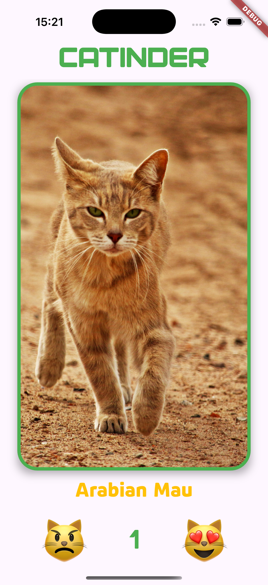
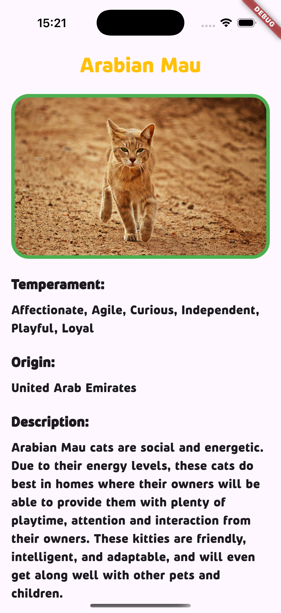

# Домашнее задание №1 "Кототиндер"
## Кузьмин Егор

Данный проект выполнялся в рамках домашнего задания по курсу "Кроссплатформенная разработка на Flutter". Проект представляет собой приложение, в котором пользователь может просматривать случайные картинки котов, ставить им положительную или отрицательную оценку и просматривать подробную информацию о породе каждого попавшегося кота.

Реализованные фичи, если не брать в расчет основной и обязательный функционал приложения, по большей части представляют собой какие-либо элементы взаимодействия с интерфейсом и дизайна. Cтарался выдержать минимализм в приложении и не нагружать его многочисленными анимациями, но в силу того, что хотелось попробовать как можно больше, некоторые "фичи" могут показаться несколько лишними (например, анимация кнопок).

Реализовано дополнительно:
- Анимация свайпа картинок в виде плавного исчезновения;
- Анимация нажатия кнопок "лайк" и "дизлайк";
- Анимация перехода между экраном с детальной информацией и главным c помощью Hero;
- Возврат на главный реализован свайпом вправо;
- Др. незначительные доработки в части дизайна, которые по мнению автора улучшают визуальную часть.

## Экраны приложения

## Скачать APK:
- https://disk.yandex.ru/d/iI1fBOSPtS31lQ
